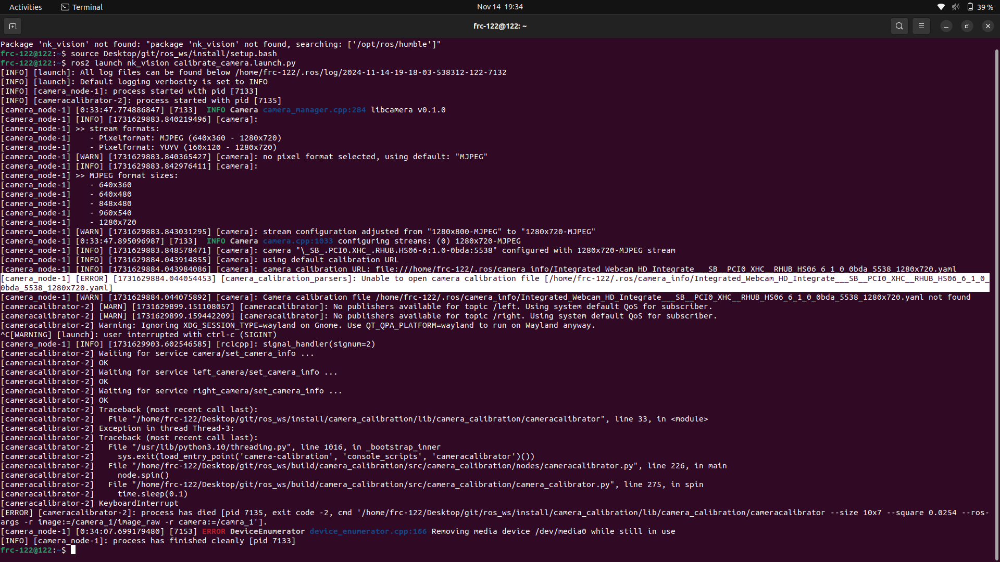

### Calibration

1. Source `/ros_ws/install/setup.bash`

2. Launch the calibrator by running `ros2 launch nk_vision calibrate_camera.launch.py`

    -   The terminal should spit out an error saying that the calibration file cannot be accessed 
        
        
        > camera_node-1] [WARN] [1731629884.044075892] [camera]: Camera calibration file /home/frc-122/.ros/camera_info/                                Integrated_Webcam_HD_Integrate___SB__PCI0_XHC__RHUB_HS06_6_1_0_0bda_5538_1280x720.yaml not found
        
        

3. Load the contents of `arducam.yaml` into the file that the terminal will spit out upon attempting calibration, as discussed in step 2. 
    If the file does not exist   create it.  

    > Our file path was named `home/frc-122/.ros/camera_info/ArducamOV9281USBCamera_Ardu___SB__PCI0_XHC__RHUB_HS01_1_2_1_0_0c45_6366_1280x800.yaml`

2. Re-run the calibration file, and update the contents of the file created in step 1.
    -   After hitting `commit`, the values of your calibration file should be spit out into the terminal.  

3. Manually copy/paste the values from the calibrator from the terminal into the file from step 2  

4. Success (hopefully)